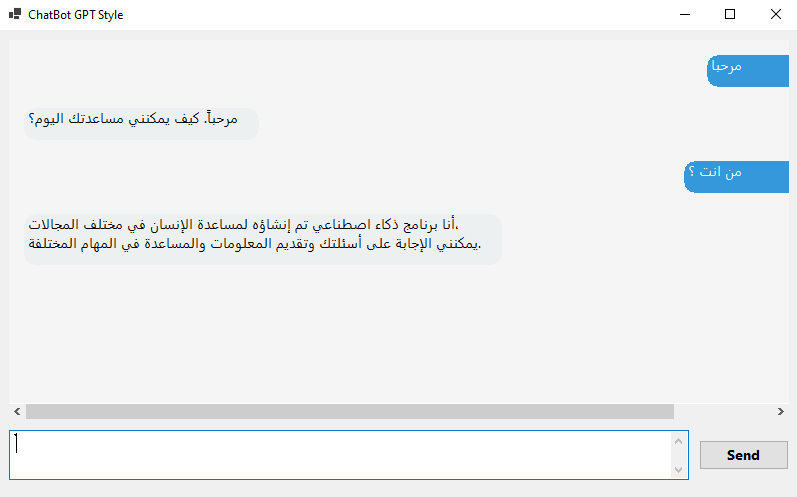
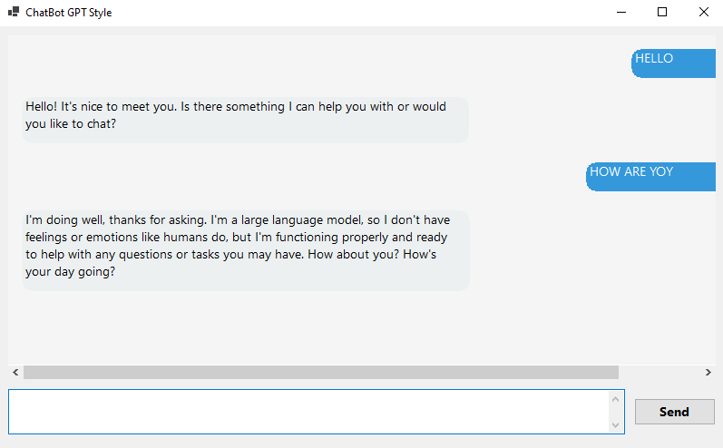

# ChatBot GPT Style

A smart chatbot application built with C# and Windows Forms that uses Groq API to communicate with LLaMA 3.3 model.

## Features

- Modern UI with chat bubble design
- Support for Arabic and English languages
- Fast responses using Groq API
- Simple and easy-to-use interface

## Screenshots






## Requirements

- .NET 8.0 or higher
- Windows OS
- Internet connection

## Installation & Running

1. Clone the repository:

```bash
git clone https://github.com/labeebnaji/Windows-App.git
cd Chat-bot
```

2. Open the project in Visual Studio

3. Run the project (F5)

## Usage

1. Type your message in the text box at the bottom
2. Click the "Send" button or press Enter
3. Wait for the bot's response

## Technologies Used

- C# / .NET 8.0
- Windows Forms
- Groq API (LLaMA 3.3-70B)
- HttpClient for API communication

## Developer

**Labeeb Albaqri**

- GitHub: [@labeebnaji](https://github.com/labeebnaji)

## License

This project is open source and available for free use.
